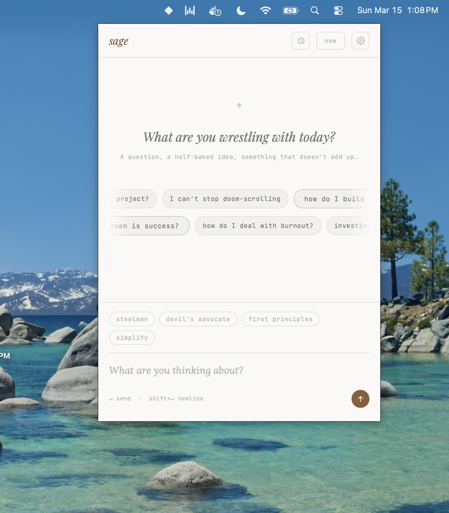
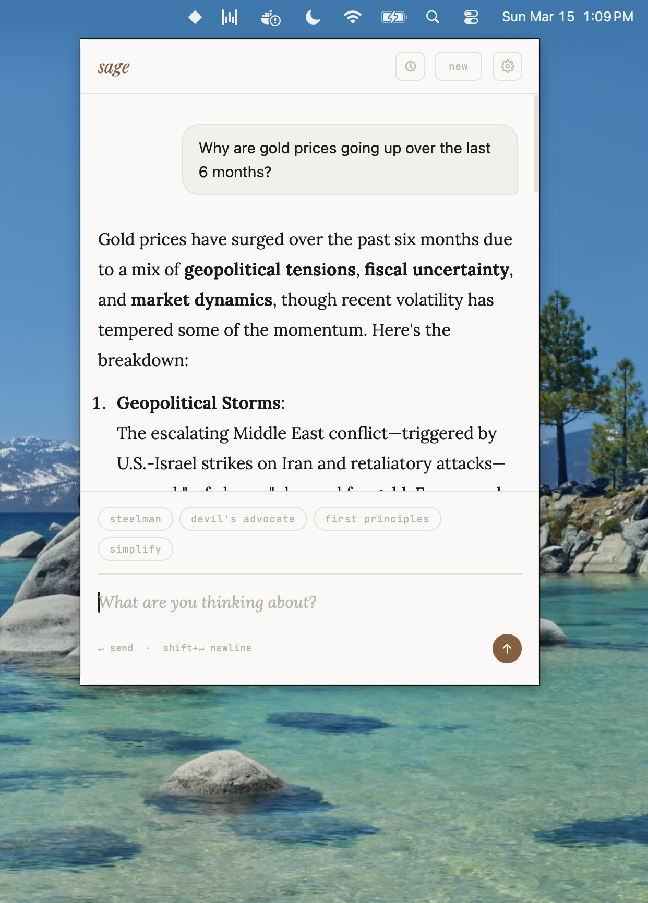

# sage

> A local-first AI thinking partner. No cloud. No account. Bring your own key.


sage lives in your menu bar. Click the icon, think out loud, get a sharp response. That's it.

It's not trying to replace your LLM subscription or your notes app. It's a scratchpad for thinking — for the half-formed idea, the question you can't stop turning over, the argument you want to pressure-test before you say it out loud.

<table>
  <tr>
    <td align="center"><br/><sub>Start from a prompt or jump straight in</sub></td>
    <td align="center"><br/><sub>Switch modes mid-conversation</sub></td>
  </tr>
</table>

---

## Why sage exists

Most AI tools are cloud products. Your conversations train models, feed dashboards, or sit on someone else's server. sage is architecturally different:

- **No backend.** sage is a Tauri desktop app. There is no sage server.
- **Your key, your calls.** You bring an [OpenRouter](https://openrouter.ai) API key. Requests go from your machine directly to OpenRouter — sage is a dumb pipe.
- **Your data stays local.** Conversations are stored in a JSON file on your disk. Nothing is synced. Nothing is sent anywhere.
- **No account.** No sign-up, no email, no tracking.

The exact technical path of your data: `your keyboard → sage → OpenRouter API → your screen`. That's the whole chain.

---

## Features

- **Menu bar app** — always one click away, out of the way when you don't need it
- **Thinking modes** — type `/` to pick a mode for any message: steelman, devil's advocate, first principles, or simplify
- **Live web search** — when your question needs current info, sage searches and shows you exactly what it's looking for in real time; steps collapse once your answer arrives but stay accessible as a toggle
- **Conversation history** — threads saved locally, searchable, exportable to Markdown
- **Model picker** — Qwen 3 by default; swap to Gemini 2.5 Pro, Claude Sonnet, GPT-4o and more via OpenRouter
- **Streaming responses** — rendered as markdown in real time
- **Topic starters** — a scrolling wall of prompts to get unstuck

---

## Install

> macOS only for now. Linux and Windows contributions welcome.

Download the latest `.dmg` from [Releases](https://github.com/hr23232323/sage-the-thinking-partner/releases) and drag sage to your Applications folder.

On first launch, click ⚙ and paste your [OpenRouter API key](https://openrouter.ai/keys). You're done.

---

## Build from source

**Prerequisites:** [Rust](https://rustup.rs) + Cargo, [Tauri CLI v2](https://tauri.app/start/prerequisites/)

```sh
# Install Tauri CLI
make setup

# Run in development mode (hot reload)
make dev

# Build a release .app
make build
```

The frontend is plain HTML/CSS/JS in `frontend/` — no bundler, no Node. Open it directly in a browser for quick UI iteration (API calls will no-op without Tauri).

---

## Privacy

sage stores two things on your machine:

| What | Where |
|---|---|
| OpenRouter API key | `~/.local/share/sage/store.json` (via [tauri-plugin-store](https://github.com/tauri-apps/plugins-workspace/tree/v2/plugins/store)) |
| Conversation history | Same file — up to 20 threads, stored locally |

Neither is ever transmitted anywhere by sage. Your API key goes directly to OpenRouter when you send a message — sage never reads it for any other purpose.

To delete everything: remove `~/.local/share/sage/`.

---

## Contributing

Bug reports, feature ideas, and pull requests are welcome. See [CONTRIBUTING.md](CONTRIBUTING.md) to get started.

---

## License

[MIT](LICENSE)
